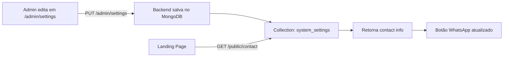

# 📞 Feature: Configuração de Contato/Vendas

## 📋 Resumo

Implementação completa de configurações de contato editáveis pelo admin, permitindo que o número de WhatsApp, e-mail e telefone sejam gerenciados dinamicamente via painel administrativo.

---

## ✨ O que foi implementado

### 🔧 Backend

#### 1. **Domínio** (`internal/domain/settings.go`)
```go
// ContactConfig define informações de contato/vendas
type ContactConfig struct {
	WhatsApp string `bson:"whatsapp" json:"whatsapp"` // Formato: 48999616679
	Email    string `bson:"email" json:"email"`
	Phone    string `bson:"phone" json:"phone"`       // Formato: +55 48 99961-6679
}

// Adicionado em SystemSettings
Contact ContactConfig `bson:"contact" json:"contact"`
```

#### 2. **Migration Automática** (`internal/bootstrap/indexes.go`)
- Função `MigrateSettings()` criada
- Executa automaticamente ao iniciar o servidor
- Adiciona campo `contact` se não existir em settings antigas
- Valores padrão:
  - WhatsApp: `48999616679`
  - Email: `suporte@theretech.com.br`
  - Phone: `+55 48 99961-6679`

#### 3. **Endpoint Público** (`internal/http/handlers/settings.go`)
```go
// GET /public/contact
func (h *SettingsHandler) GetPublicContact(c *gin.Context)
```

**Response:**
```json
{
  "whatsapp": "48999616679",
  "email": "suporte@theretech.com.br",
  "phone": "+55 48 99961-6679"
}
```

**Características:**
- ✅ Público (sem autenticação)
- ✅ CORS habilitado
- ✅ Usado pela landing page

---

### 🎨 Frontend

#### 1. **Landing Page** (`retech-core-admin/app/page.tsx`)

**Busca dinâmica de contato:**
```typescript
useEffect(() => {
  const apiUrl = process.env.NEXT_PUBLIC_API_URL || 'http://localhost:8080';
  
  fetch(`${apiUrl}/public/contact`)
    .then(res => res.json())
    .then(data => setContact(data))
    .catch(err => {
      console.error('Erro ao carregar contato:', err);
      // Fallback com valores padrão
      setContact({
        whatsapp: '48999616679',
        email: 'suporte@theretech.com.br',
        phone: '+55 48 99961-6679'
      });
    });
}, []);
```

**Botão "Falar com Vendas":**
```tsx
const whatsappLink = contact?.whatsapp 
  ? `https://wa.me/55${contact.whatsapp}?text=Olá! Gostaria de saber mais sobre a Retech Core API`
  : '#';

<a href={whatsappLink} target="_blank" rel="noopener noreferrer">
  <Button>Falar com Vendas</Button>
</a>
```

#### 2. **Admin Settings** (`retech-core-admin/app/admin/settings/page.tsx`)

**Novo Card "Contato & Vendas":**
- 📱 Campo WhatsApp (apenas números)
- 📧 Campo E-mail de Suporte
- 📞 Campo Telefone (formatado)
- ℹ️ Info box explicando uso na landing page

**Interface:**
```typescript
interface SystemSettings {
  // ... outros campos
  contact?: {
    whatsapp: string;
    email: string;
    phone: string;
  };
}
```

---

## 🔄 Fluxo Completo



---

## 🧪 Como Testar

### 1. **Testar Endpoint Público**
```bash
curl http://localhost:8080/public/contact | jq
```

**Resposta esperada:**
```json
{
  "email": "suporte@theretech.com.br",
  "phone": "+55 48 99961-6679",
  "whatsapp": "48999616679"
}
```

### 2. **Testar Admin UI**
1. Acesse `http://localhost:3000/admin/settings`
2. Scroll até "Contato & Vendas" (card verde)
3. Edite o WhatsApp: `48999616679` → `11987654321`
4. Clique em "Salvar Configurações"
5. Verifique endpoint: `curl http://localhost:8080/public/contact`

### 3. **Testar Landing Page**
1. Acesse `http://localhost:3000`
2. Scroll até "Falar com Vendas"
3. Clique no botão
4. Deve abrir WhatsApp com número configurado

---

## 🚀 Deployment

### Backend
```bash
cd retech-core
git pull origin main
docker-compose -f build/docker-compose.yml up -d --build api
```

### Frontend
```bash
cd retech-core-admin
git pull retech-core-admin main
# Railway/Vercel rebuild automático
```

### Verificar Migration em Produção
```bash
# Logs do Railway
railway logs --service retech-core

# Buscar por:
# "Migrando configurações..."
# "Migração de configurações concluída"
```

---

## 📊 Resultados

### Antes ❌
- Número de WhatsApp hardcoded no código
- Impossível alterar sem deploy
- Manutenção difícil

### Depois ✅
- Número editável via admin
- Sem necessidade de deploy
- Migration automática para ambientes existentes
- Fallback caso API falhe
- Endpoint público otimizado

---

## 🎯 Próximos Passos

1. ✅ Backend com `ContactConfig`
2. ✅ Migration automática
3. ✅ Endpoint público `/public/contact`
4. ✅ Admin UI para editar
5. ✅ Landing page usando configuração dinâmica
6. ⏳ Testar em produção Railway
7. ⏳ Monitorar logs de erro no frontend

---

## 🔍 Monitoramento

### Logs Backend
```bash
docker-compose -f build/docker-compose.yml logs api | grep -i "contact"
```

### Logs Frontend (Browser)
- Console deve mostrar: `✅ Contato carregado: {...}`
- Ou fallback: `❌ Erro ao carregar contato:`

---

## 📝 Commits

### Backend
```
feat(settings): adiciona migration automática do campo contact

- MigrateSettings no bootstrap
- Adiciona campo contact automaticamente em settings antigas
- Executa na inicialização do servidor
- Valores padrão: whatsapp 48999616679
```

### Frontend - Landing
```
fix(landing): adiciona fallback para contato e melhor tratamento de erro

- Fallback com valores padrão caso API falhe
- Melhor tratamento de erro HTTP
- Log de debug para facilitar troubleshooting
```

### Frontend - Admin
```
feat(admin): adiciona campos de contato/vendas na tela de configurações

UI:
- Novo card 'Contato & Vendas' (verde)
- Campo WhatsApp (número sem formatação)
- Campo E-mail de Suporte
- Campo Telefone (formatado para exibição)
- Info box explicando que é usado na landing page
```

---

## ✅ Checklist de Implementação

- [x] Domain: `ContactConfig` struct
- [x] Backend: `MigrateSettings()` function
- [x] Backend: Endpoint `/public/contact`
- [x] Backend: Update `SystemSettings`
- [x] Frontend Admin: Interface `SystemSettings`
- [x] Frontend Admin: UI Card "Contato & Vendas"
- [x] Frontend Landing: Fetch dinâmico
- [x] Frontend Landing: Fallback com valores padrão
- [x] Frontend Landing: Botão WhatsApp dinâmico
- [x] Testes locais
- [x] Commits e pushes
- [ ] Testes em produção

---

## 🎨 Screenshots

### Admin Settings


### Landing Page


---

**✨ Feature completa e pronta para produção!**

